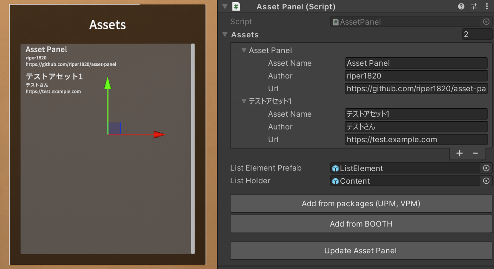

# Asset Panel

The panel which displays the list of assets used in your VRChat world.

VRChatワールドで利用中のアセットを一覧表示するためのパネルです。

## Usage / 使い方

[English Document](./Documentation/usage-en.md) `Documentation/usage-en.md`

[日本語ドキュメント](./Documentation/usage-ja.md) `Documentation/usage-ja.md`

## Third-Party Assets

This package includes the following third-party assets:

### Noto Sans Japanese
- **License**: SIL Open Font License 1.1
- **Copyright**: Copyright 2014-2021 Adobe
- **Source**: https://fonts.google.com/noto/specimen/Noto+Sans+JP
- **License File**: `Runtime/Fonts/OFL.txt`
